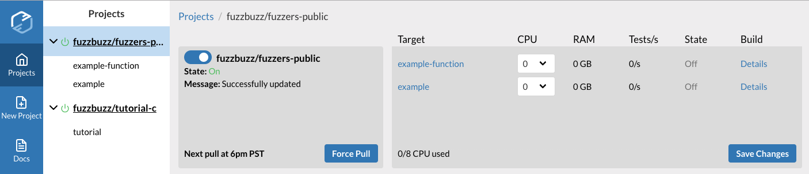
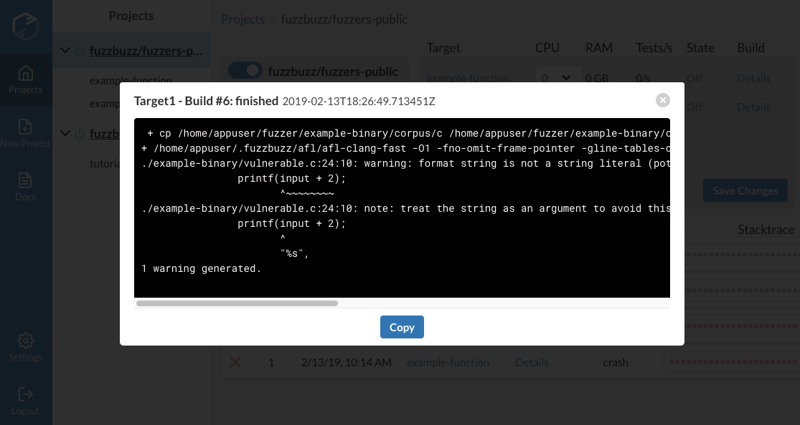

# Running Fuzzing Jobs

## Sanity Checks

Once you've configured all of your targets, it's time to start fuzzing for bugs. To ensure your targets are ready to be fuzzed, run the following command from your project directory:

```bash
fuzzbuzz validate
```

This checks your fuzz.yaml for any errors and shows you all the targets Fuzzbuzz will detect, so you don't need to repeatedly push your code to check for errors. To make sure everything builds properly, you can run your setup steps using:

```text
fuzzbuzz target build <your-target-name>
```

And, if your target has a test corpus, you can test the target with every file in the corpus by running:

```text
fuzzbuzz target test <your-target-name>
```

## Fuzz Your Code

When you've got your targets all set up, the next step is to push your new code to Fuzzbuzz. This takes many forms depending on the type of project, and you can read about how exactly to get your code on the platform [here](projects.md).

Once your code has been pushed, head to [https://app.fuzzbuzz.io](https://app.fuzzbuzz.io). If you click your project's name in the sidebar, you'll see the main project view.



The left side of the view tell you the current status of your project. You can use the switch to turn it off, which will stop all currently running fuzzing jobs. If there are any errors with your project, such as problems with your `fuzz.yaml`, they will be displayed here.

The right side of the view lists all of the targets on your project, as well as some information about their current fuzzing state. To begin fuzzing a target, simply choose a CPU value and press "Save Changes". This will distribute the target over the number of CPUs you specified, build it, and begin fuzzing it. All future updates to the project will update this target with the new version of the code automatically, so there's no need to reset this number every update - only when you want to change how you distribute your targets over the infrastructure.

Shortly after the target has fuzzing, stats like the number of tests per second will be available. Any errors with your target during the build and deploy process can be shown by clicking the "Details" link under the Build header.




