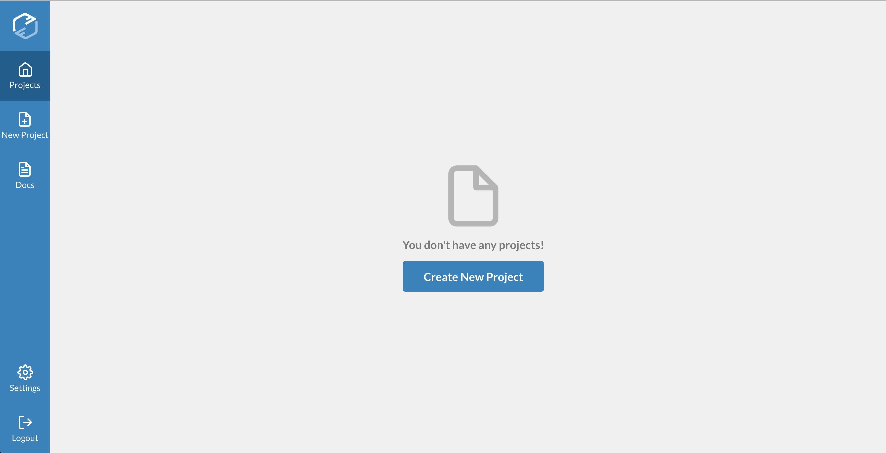

# Projects

## Connect your project

Every project is connected to Fuzzbuzz either through a service like GitHub, which uses webhooks to automatically update the code on the platform, or via a manual update system, such as uploading a new Zip File whenever new code should be tested.

After logging into the dashboard for the first time, you will see the following screen:



Click "Create New Project" and follow the instructions to connect your code to Fuzzbuzz.

## Configure your project

Every project has a `fuzz.yaml` in its root directory, that defines how to set up and fuzz the project. The first part of the file, described here, contains configuration for your entire project. A sample `fuzz.yaml` is provided below:



```yaml
base: ubuntu:16.04
environment:
- KEY=value
- KEY2=value2
setup:
- sudo apt-get update
- sudo apt-get install make
language: go
version: "1.11"
targets:
    # targets list omitted
```



The `base` field specifies which operating system to use when running your code. As of now, the only option is `ubuntu:16.04` which specifies a basic Docker container with an Ubuntu image.

The `environment` field contains environment variables to be used for the whole project, and `setup` should be used to install dependencies needed for the entire project, such as build tools. The `language` and `version` fields can be specified at the root of the file, or for each target specifically. Finally, `targets` contains configuration for each of the project's fuzz targets.

For a more detailed description of how to write your `fuzz.yaml` take a look at our [Configuration Documentation](../reference/configuration.md).

