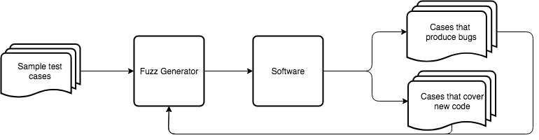

# Fuzzing 101

### What is fuzzing?

Fuzzing is a software testing methodology that is great at finding obscure bugs that developers miss. Instead of testing with a small, pre-defined set of cases \(like unit testing\), fuzzing tests code 24 hours a day, using the feedback and results it gathers to generate new cases \(called fuzz\), in an effort to exercise all aspects of the software in question. You can think of fuzzing as a feedback loop:

### Why should I fuzz my code?

Unit testing, and other developer-driven testing methods, are great for sanity checks, and ensuring that your code handles all of the cases your developers have thought about. It allows for some level of certainty that the code in question still processes the cases you've chosen to test in the same manner. In other words, unit testing checks that foreseen problems are handled properly. Where unit tests fall short is in the unknown; they look for exactly what you ask them to, and nothing more.

Fuzzing is so effective because it takes a completely different approach to software verification than human-driven test methodologies such as unit testing, code review, manual debugging and even static analysis. By continuously fuzzing your code, you immediately increase your bug-finding potential to include the unforeseen problems that aren't covered by static analysis rules or your developer's imaginations. Fuzzing covers an area of your software test pipeline that no other type of testing methodology touches.

### Where does Fuzzbuzz come in?

It's relatively simple to decide what part of your code you'd like to fuzz - if you can write a unit test, you can write a fuzz test. It's less straightforward to integrate continuous fuzzing into a CI pipeline, intelligently generate tests, track how much code the tests cover, capture and categorize bugs, and ensure that bugs aren't re-introduced after they are fixed.

To learn how Fuzzbuzz automates all of these steps, check out our Platform Overview:



