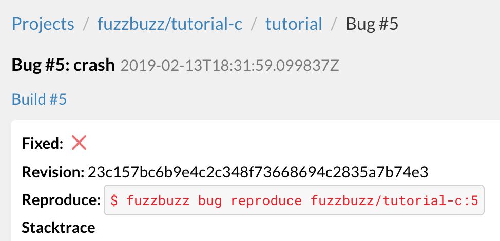

# Fixing Bugs

## Step 7: Fix the bug

You can use the Fuzzbuzz CLI to reproduce any bug found on the platform, locally on your machine. This allows you to ensure that the bug has been fixed, before actually committing your new code. When inspecting any bug from the web UI, you will see a "reproduce" command that you can copy and run in the CLI.

Running this reproduce command will download the specific test case that caused this bug, and run the test locally on your machine. This allows you to fix bugs, and then use the CLI to ensure you haven't missed anything, before merging your new code.

After you've merged your new code, Fuzzbuzz will pick your changes up and test them in the background to see if they fix any of the currently open bugs. If they do, you'll see those bugs automatically become marked as fixed on the platform.

