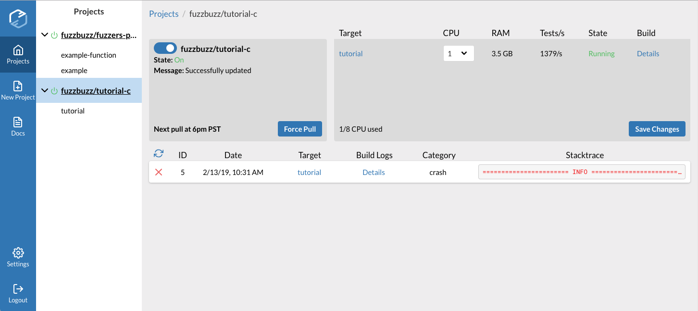
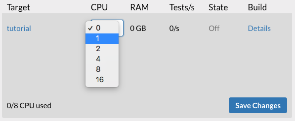

# Catching Bugs

## Step 5: Set up your Project

We'll use the Fuzzbuzz CLI to deploy code directly, rather than pulling from a GitHub repository.

To make sure everything is working, run this command from the tutorial directory:

```bash
fuzzbuzz validate
```

You should see that Fuzzbuzz reads the fuzz.yaml and detects the one target we have, called "tutorial". To make sure that all of the setup steps work, we can run:

```text
fuzzbuzz target build tutorial
```

This will run the target's setup steps in a local Docker container, using the same environment it would on the Fuzzbuzz platform, so you can make sure everything's set up right. Finally, you can run:

```bash
fuzzbuzz project create
```

Choose Zip File, give your project a Name and Description, and then wait as the tutorial project is bundled up and deployed to Fuzzbuzz. If you head to [https://app.fuzzbuzz.io](https://app.fuzzbuzz.io/), you should see your new project waiting for you in the sidebar.



## Step 6: Fuzz your code! <a id="step-6-fuzz-your-code"></a>

Give a target 1 CPU to fuzz on, and press "Save Changes".  




After a few minutes, you should see an entry pop up in the list of bugs. Congratulations - you've just found your first bug with Fuzzbuzz!

Head to the next page to learn how to fix the bug.

